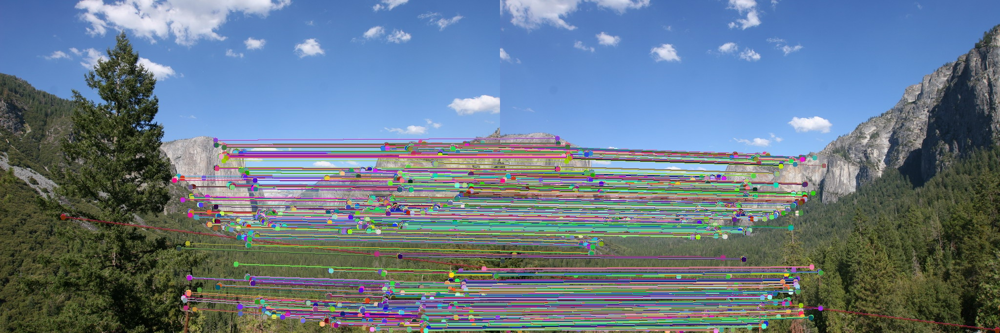
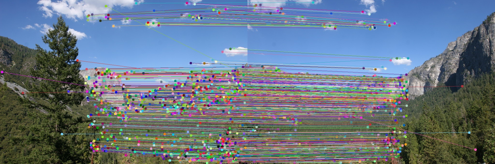
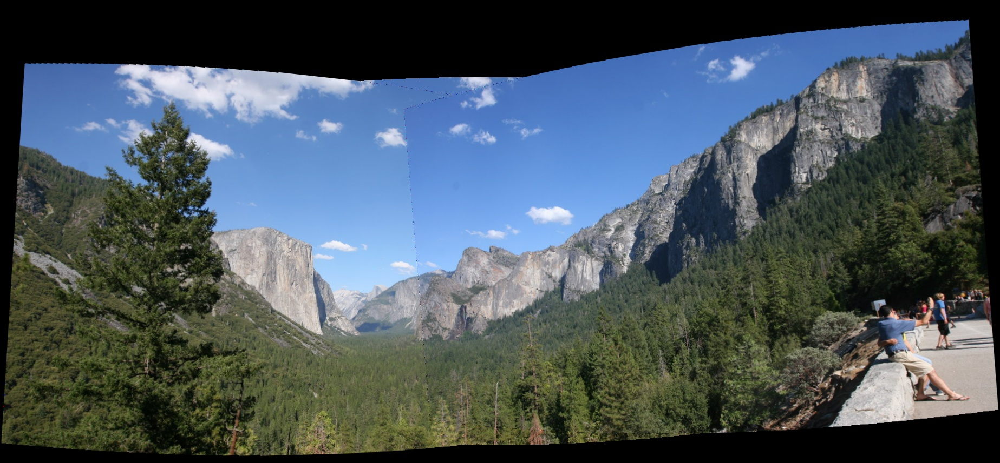

# Panorama Stitching

## Overview

This project focuses on creating a panorama by stitching multiple images together using feature detection and matching techniques. The goal is to align and merge images seamlessly, producing high-quality panoramic images. The project leverages advanced computer vision methods, including:

- **Feature detection** using algorithms like SIFT (Scale-Invariant Feature Transform)
- **Feature matching** to align corresponding points across images
- **Homography estimation** to transform images into a common plane
- **Image blending** to merge overlapping regions smoothly

The project also explores the optimization of the stitching pipeline for improved accuracy and performance.

## Files and Directory Structure

### Data

- `data1`, `data2`, `data3`, `data4`: These directories contain the raw image datasets that are used for stitching together into a panorama.
- `data.xlsx`: A data file that includes metadata about the images, such as image properties, filenames, or transformations applied during the project.

### Results and Intermediate Outputs

- `matching_result`: Contains the output of feature matching between images. It typically includes visualizations of matched keypoints and their corresponding matches across images.
  - Example:
      
    *Figure 1: Visual representation of feature matching between two images.*

- `sift`: Contains the SIFT feature maps generated for each image, showing the detected keypoints and descriptors used for matching.
  - Example:
      
    

- `result`: Contains the final stitched panorama images produced by merging all input images.
  - Example:
      
   

### Notebooks and Scripts

- `Panorama_Stitching.ipynb`: This Jupyter notebook implements the core functionality for panorama stitching. It includes feature detection, descriptor matching, homography computation, and image blending.
  
- `main.ipynb`: The main notebook that orchestrates the panorama stitching process, loads data, and processes images step-by-step.

### Documentation and Reports

- `Homework2_2024.pdf`: A report or assignment that describes the project methodology, challenges, results, and conclusions. This could be part of an academic assignment.
  
- `22421378.pdf`: Another document related to the project, possibly containing references or supplementary material.

### Environment and Dependencies

- `envs.yml`: A Conda environment file for creating a virtual environment that matches the dependencies required for the project. You can create the environment with the following command:
  ```bash
  conda env create -f envs.yml
